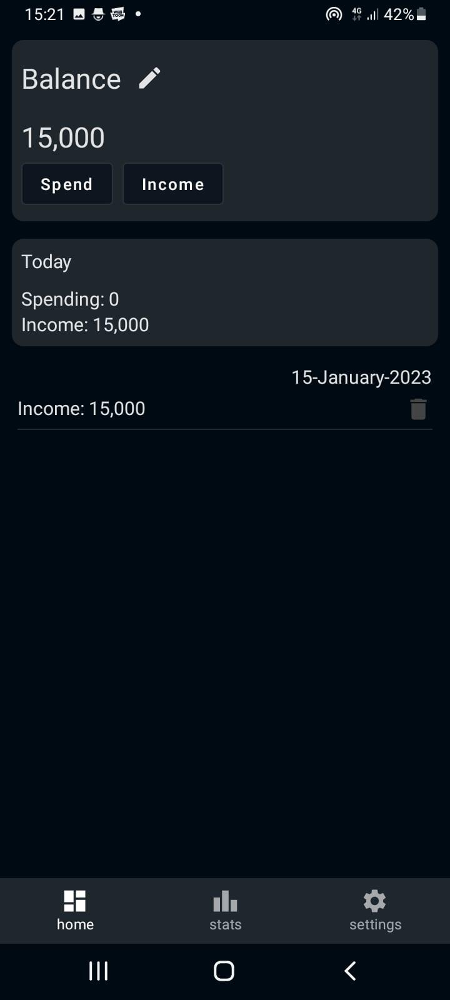
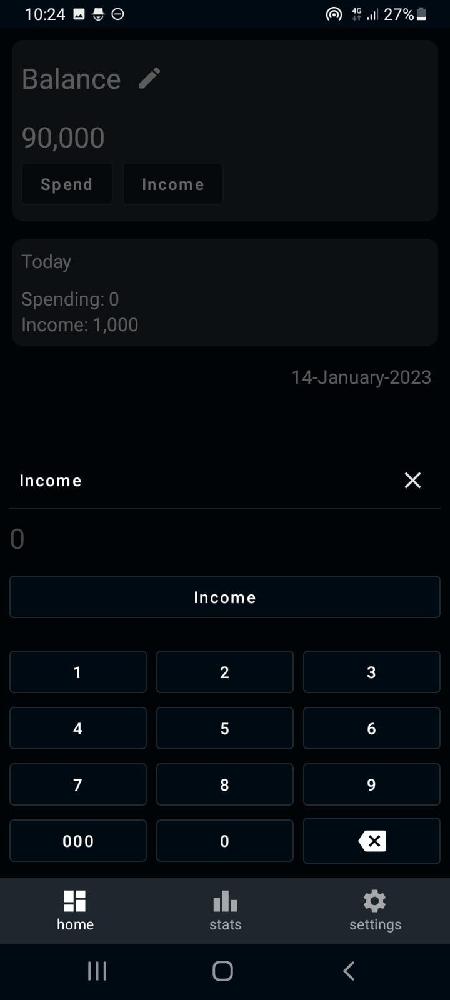
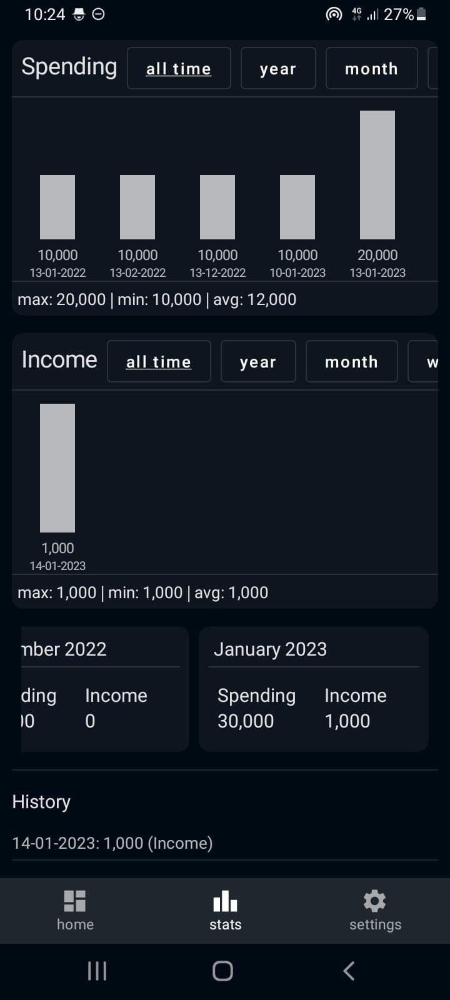

# Finance App

  

  

Download [finance_1.3-release.apk](https://github.com/nursyah21/financeapp-android/releases/download/version_1.3/finance_1.3-release.apk)

the sign-in key app from github and on playstore is different

screenshots application

  
  
  

feature:

- simple ui
- dark theme
- chart bar
- backup and restore data

readmore : https://nursyah21.github.io/post/finance_app_android/
